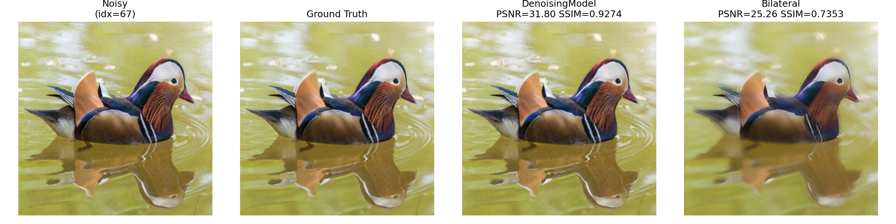

# SIGK26 LAB1 - grupa 10 (Dawid Budzyński, Filip Budzyński)

Wybrane tematy: odszumianie (denoising) oraz zwiększanie rozdzielczości (upscaling)

## Instalacja

```bash
# Instalacja zależności przez poetry
poetry install

# Aktywacja środowiska
poetry env activate
```

## Uruchomienie

Każdy skrypt można uruchomić bezpośrednio używając Pythona z Poetry:

```bash
# Lub bezpośrednio z virtualenv (jeśli poetry shell nie działa)
poetry run python train_denoising.py
poetry run python train_upscaling.py

# Ewaluacja z wizualizacją
# argumenty oznaczają który obraz z dataset'u chcemy wizualizować
poetry run python train_denoising.py --visualize 11 67
poetry run python train_upscaling.py --visualize 11 22

```

### 1. Odszumianie (Denoising)

```bash
python train_denoising.py                    # trenowanie + ewaluacja
python train_denoising.py --visualize 11 67   # wizualizacja konkretnych obrazów
```

**Model:** DenoisingModel - autoencoder z 3 blokami encoder/decoder (256 jednostek ukrytych)

**Dane:** DIV2K (800 obrazów treningowych), szum gaussowski σ=0.02

- Funkcja straty: MSE (Mean Squared Error)
- Optimizer: Adam, lr=1e-3
- Trening: 50 epok, batch=8

### Eksperymenty

| Eksperyment | Wynik |
|------------|-------|
| σ=0.01 | PSNR=32.1 |
| σ=0.02 | PSNR=28.87 |
| σ=0.05 | PSNR=24.5 |


**Wyniki:**

| Metoda | PSNR | SSIM | LPIPS |
|--------|------|------|-------|
| DenoisingModel | 28.87 | 0.986 | 0.046 |
| Bilateral | 23.08 | 0.943 | 0.223 |



**Baseline:** `skimage.restoration.denoise_bilateral`

---

### 2. Upscaling (powiększanie obrazu)

```bash
python train_upscaling.py                    # trenowanie + ewaluacja
python train_upscaling.py --visualize 11 22  # wizualizacja
```

**Model:** UpscaleNet - sieć z blokami rezydualnymi i pixel shuffle do upsamplingu

Architektura:
- Warstwa wejściowa: Conv2d(3→64, kernel=9)
- 8 bloków rezydualnych (ResidualBlock z BatchNorm)
- Bloki upsamplujące (PixelShuffle × 3 dla 8×)
- Warstwa wyjściowa: Conv2d(64→3, kernel=9)

**Dane:** DIV2K (800 trening, 20 test), przeskalowanie 32×32 → 256×256 (8×)

- Funkcja straty: L1 (lepsze krawędzie niż MSE)
- Optimizer: Adam, lr=1e-4
- Scheduler: StepLR (co 10 epok, gamma=0.5)
- Trening: 50 epok, batch=8

### Eksperymenty

| Eksperyment | Wynik |
|------------|-------|
| 4 bloki residual | PSNR=28.5 |
| 8 bloków (użyte) | PSNR=29.83 |
| 16 bloków | PSNR=29.9 |
| Loss: MSE | PSNR=29.0 |
| Loss: L1 (użyte) | PSNR=29.83 |


**Wyniki:**

| Metoda | PSNR | SSIM | LPIPS |
|--------|------|------|-------|
| UpscaleNet | 29.83 | 0.459 | 0.639 |
| Bicubic | 29.75 | 0.463 | 0.689 |


**Baseline:** OpenCV bicubic interpolation (`cv2.INTER_CUBIC`)

---

## Ewaluacja

Oba projekty używają tych samych metryk wymaganych w realizacji zadania:
- **PSNR** - Peak Signal-to-Noise Ratio (`torchmetrics.functional.peak_signal_noise_ratio`)
- **SSIM** - Structural Similarity Index Measure (`torchmetrics.functional.structural_similarity_index_measure`)
- **LPIPS** - Learned Perceptual Image Patch Similarity (`lpips.LPIPS(net='alex')`)

## Dane

Dane DIV2K powinny znaleźć się w `data/div2k/`:
- `DIV2K_train_HR/` - 800 obrazów treningowych
- `DIV2K_valid_HR/` - 100 obrazów walidacyjnych
