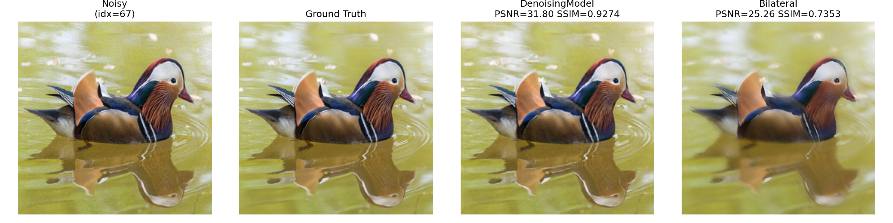
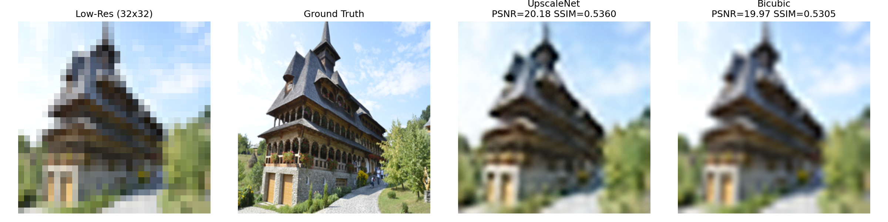

# SIGK26 grupa 10 (Dawid Budzyński, Filip Budzyński)

Wybrane tematy lab 1: odszumianie (denoising) oraz zwiększanie rozdzielczości (upscaling).
Projekt 5: generacja animacji stickmana modelem dyfuzyjnym
(szczegóły w [`README_stickanim.md`](README_stickanim.md)).

## Instalacja

```bash
# Instalacja zależności przez uv (synchronizuje .venv z pyproject.toml + uv.lock)
uv sync

# Aktywacja środowiska (opcjonalnie — można też uruchamiać każdy skrypt przez `uv run …`)
source .venv/bin/activate
```

## Uruchomienie

```bash
uv run python train_denoising.py
uv run python train_upscaling.py

# Ewaluacja z wizualizacją
# argumenty oznaczają który obraz z dataset'u chcemy wizualizować
uv run python train_denoising.py --visualize 11 67
uv run python train_upscaling.py --visualize 11 22
```

### 1. Odszumianie (Denoising)

```bash
python train_denoising.py                    # trenowanie + ewaluacja
python train_denoising.py --visualize 11 67   # wizualizacja konkretnych obrazów
```

**Model:** DenoisingModel - autoencoder z 3 blokami encoder/decoder (256 jednostek ukrytych)

**Dane:** DIV2K (800 obrazów treningowych), szum gaussowski σ=0.02

**Wyniki:**

| Metoda | PSNR | SSIM | LPIPS |
|--------|------|------|-------|
| DenoisingModel | 28.87 | 0.986 | 0.046 |
| Bilateral | 23.08 | 0.943 | 0.223 |



**Baseline:** `skimage.restoration.denoise_bilateral`

---

### 2. Upscaling (powiększanie obrazu)

```bash
python train_upscaling.py                    # trenowanie + ewaluacja
python train_upscaling.py --visualize 11 22  # wizualizacja
```

**Model:** UpscaleNet - sieć z blokami rezydualnymi i pixel shuffle do upsamplingu

Architektura:
- Warstwa wejściowa: Conv2d(3→64, kernel=9)
- 8 bloków rezydualnych (ResidualBlock z BatchNorm)
- Bloki upsamplujące (PixelShuffle × 3 dla 8×)
- Warstwa wyjściowa: Conv2d(64→3, kernel=9)

**Dane:** DIV2K (800 trening, 20 test), przeskalowanie 32×32 → 256×256 (8×)

**Wyniki:**

| Metoda | PSNR | SSIM | LPIPS |
|--------|------|------|-------|
| UpscaleNet | 19.68 | 0.435 | 0.654 |
| Bicubic | 20.13 | 0.458 | 0.689 |



**Baseline:** OpenCV bicubic interpolation (`cv2.INTER_CUBIC`)

---

## Ewaluacja

Oba projekty używają tych samych metryk wymaganych w realizacji zadania:
- **PSNR** - Peak Signal-to-Noise Ratio (`torchmetrics.functional.peak_signal_noise_ratio`)
- **SSIM** - Structural Similarity Index Measure (`torchmetrics.functional.structural_similarity_index_measure`)
- **LPIPS** - Learned Perceptual Image Patch Similarity (`lpips.LPIPS(net='alex')`)

---

### 3. Stick Animation (Projekt 5 — generacja chodu/skoku)

```bash
# 1) przygotuj dane CMU MoCap pod data/raw/{walk,jump}/*.bvh
uv run python -m src.stick_animation.prepare_data --raw-dir data/raw --out-dir data/stickanim
# 2) trening + ewaluacja
uv run python train_stickanim.py --data-dir data/stickanim --epochs 400
# 3) ablacje
uv run python experiments_stickanim.py --data-dir data/stickanim --out-dir output/stickanim_experiments
```

Architektura: spatio-temporal Diffusion Transformer (per-joint tokens) z DCT
branchem, cosine schedule, v-prediction, DDIM sampling, CFG, multi-objective
loss (bone-length + smoothness + foot-skating). Pełny opis i porównanie z
publiczną realizacją Filipa Langiewicza w `README_stickanim.md`.

## Dane

DIV2K (lab 1) — `data/div2k/`:
- `DIV2K_train_HR/` - 800 obrazów treningowych
- `DIV2K_valid_HR/` - 100 obrazów walidacyjnych

CMU MoCap (projekt 5) — `data/raw/{walk,jump}/`:
- pliki `.bvh` z [`una-dinosauria/cmu-mocap`](https://github.com/una-dinosauria/cmu-mocap),
  posegregowane wg arkusza opisowego datasetu.
