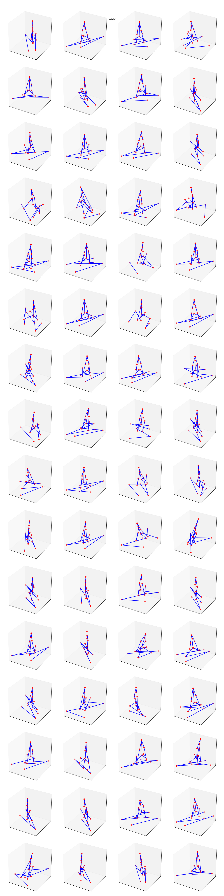
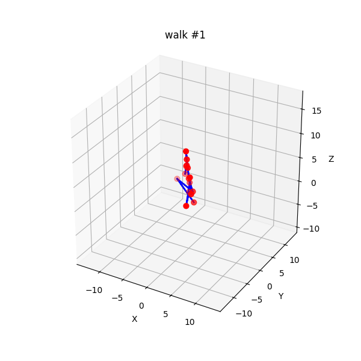
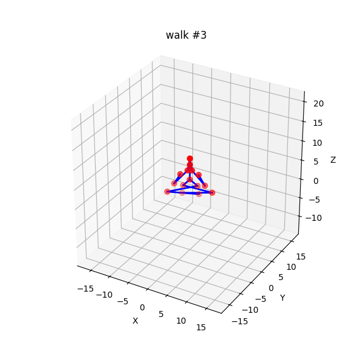
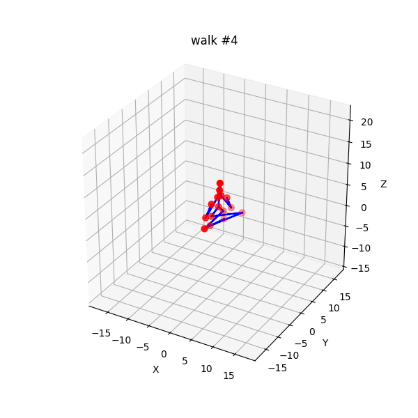
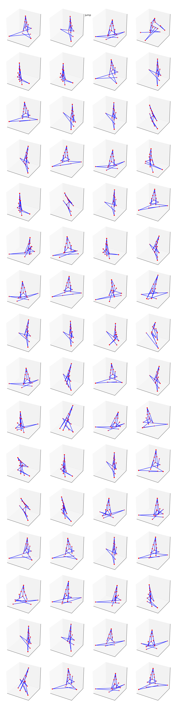
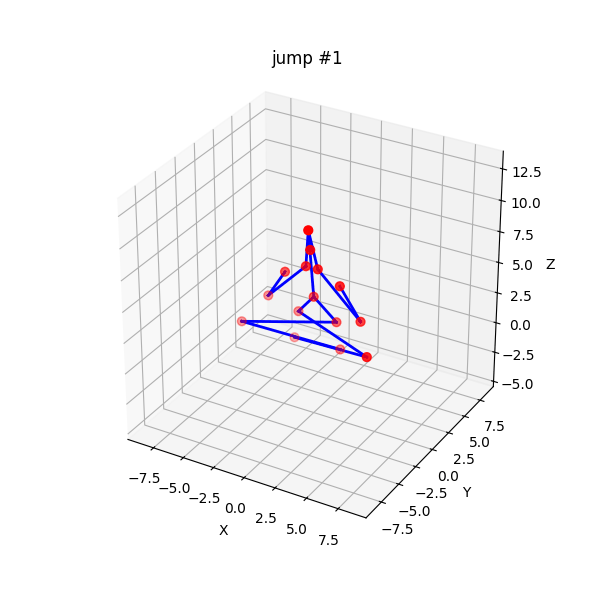
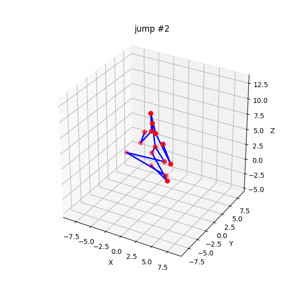
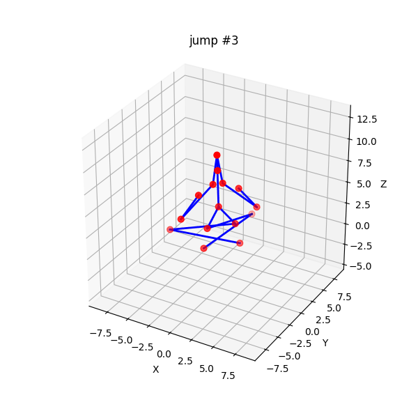
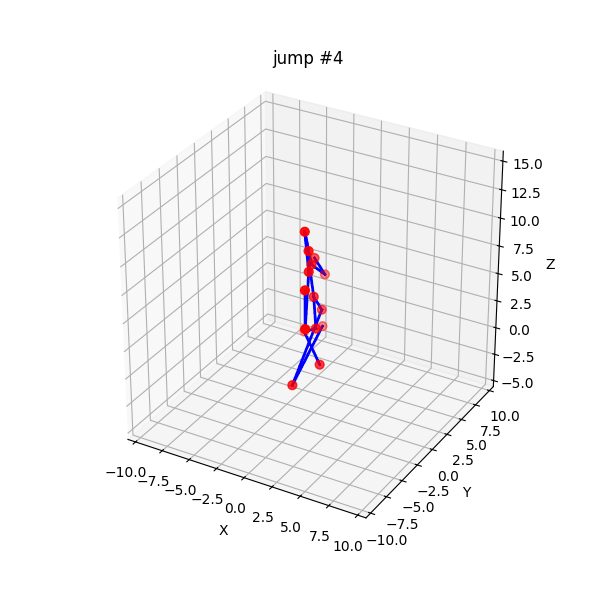

# SIGK26 Projekt 5 — Stick Animation (Diffusion)

**Autorzy:** Dawid Budzyński, Filip Budzyński (grupa 10)

---

## Metoda

### Reprezentacja ruchu

Zamiast pracować na surowych pozycjach stawów w przestrzeni świata (`[T, 15, 3]`),
każdą sekwencję dekomponujemy na kanoniczeną reprezentację `[T, 47]`:

| Pole | Wymiar | Opis |
|---|---|---|
| `root_xy_vel` | 2 | Prędkość miednicy w płaszczyźnie XY |
| `root_z` | 1 | Wysokość miednicy |
| `root_yaw` | 2 | Kierunek twarzy: `(sin θ, cos θ)` |
| `local` | 42 | 14 stawów nie-root w układzie lokalnym miednicy (po zerowania yaw), skalowane przez `bone_scale` |

Taka dekompozycja pozwala sieci uczyć się pozy i ruchu globalnego niezależnie,
a post-processing `snap_bone_lengths` przywraca poprawne długości kości BFS
od miednicy w dół (forward kinematics).

### Architektura — Spatio-Temporal DiT

Model to 14,5M-parametrowy Diffusion Transformer z osiową atencją:

```
input [B, T=48, F=47]
    │ split: root [B,T,5]  local [B,T,14,3]
    ▼
per-joint linear projection + joint identity embedding
    [B, T, J=15, D=256]
    │ × 6 warstw
    ├── Spatial DiT block   — atencja po stawach (per-frame) + bias z grafu szkieletu
    └── Temporal DiT block  — atencja po klatakach + 8 tokenach DCT
    ▼
LayerNorm → głowice root/local
output v_pred [B, T, 47]
```

Kluczowe elementy:
- **AdaLN-Zero** (DiT, Peebles & Xie) — conditioning przez timestep + klasę ruchu; start jako identyczność.
- **Skeleton attention bias** — logit `-d_graf(j_a, j_b)` w atencji przestrzennej; bliższe stawy w drzewie kinematycznym silniej się „widzą".
- **DCT frequency tokens** (PoseFormerV2) — 8 niskoczęstotliwościowych współczynników DCT-II każdego stawu dołączonych do osi czasowej.
- **Fused Flash Attention** (`F.scaled_dot_product_attention`) — CUDA FlashAttention-2/MemEfficient z bfloat16.

### Dyfuzja i sampling

| Komponent | Wybór | Uzasadnienie |
|---|---|---|
| Schedule szumu | cosine (Nichol & Dhariwal 2021) | Lepsze pokrycie niskich SNR niż linear |
| Parametryzacja | v-prediction (Salimans & Ho 2022) | Stabilniejsza na znormalizowanych współrzędnych |
| Sampler | DDIM 50 kroków (Song et al. 2020) | ~20× szybciej niż pełne DDPM bez utraty jakości |
| Conditioning | Classifier-Free Guidance `w=3.0` | Sterowanie klasą ruchu (walk / jump) |

### Funkcja straty

```
L = L_v  +  0.1·L_vel  +  0.5·L_bone  +  0.05·L_smooth  +  0.2·L_foot
```

| Składnik | Opis |
|---|---|
| `L_v` | MSE predykcji v-prediction |
| `L_vel` | Dopasowanie różnic czasowych target vs pred |
| `L_bone` | MSE długości kości vs długości spoczynkowe (zapobiega „oddychaniu" kości) |
| `L_smooth` | Kara za przyspieszenie (E_smooth z VNect) — tłumi jitter |
| `L_foot` | Soft-gated prędkość pozioma kostki przy kontakcie z podłogą |

### Dane i trening

- **Dataset:** CMU MoCap (una-dinosauria/cmu-mocap) — 56 prób chodu, 28 prób skoku
- **Podział:** 668 sekwencji treningowych (360 walk + 308 jump), 17 testowych (11 + 6)
- **Augmentacja:** rotacja wokół osi Z + odbicie lustrzane lewo/prawo + time-warp + zmiana prędkości
- **Trening:** 400 epok, AdamW lr=2e-4, cosine annealing → 1e-6, batch=64, EMA decay=0.999
- **Sprzęt:** NVIDIA GeForce RTX 5070, AMP bfloat16, TF32, `cudnn.benchmark`
- **Czas treningu:** ~17 minut

---

## Wyniki

### Tabela 1: Główne metryki jakości generacji

Metryki liczone na próbkach root-relative (translacja globalna nie wpływa na wynik).
Na zbiorze testowym wygenerowano 64 próbki per klasa przy DDIM 50 kroków i CFG `w=3.0`.

| Ruch | FMD ↓ | MPJPE ↓ | Var (pairwise) ↑ | Var (joint std) ↑ | Var (vel std) ↑ |
|------|--------|---------|------------------|-------------------|-----------------|
| walk | 617.88 | 5.033   | 10.376           | 4.659             | 0.265           |
| jump | 868.58 | 5.593   | 11.025           | 1.357             | 0.208           |

> **FMD** — Fréchet Motion Distance (niżej = bliżej rozkładu rzeczywistego).
> **MPJPE** — Mean Per-Joint Position Error względem najbliższego sąsiada (mm przy bone_scale≈1).
> **Var** — miara różnorodności generowanych sekwencji (wyżej = bardziej kreatywny model).

### Tabela 2: Historia treningu (kluczowe epoki)

| Epoka | Loss total | Primary | Bone | Smooth | Foot | LR |
|-------|-----------|---------|------|--------|------|----|
| 1     | 1.660      | 0.995   | 0.398 | 7.132 | 0.060 | 2e-4 |
| 50    | ~0.55      | ~0.42   | ~0.13 | ~0.80 | ~0.03 | ~1.8e-4 |
| 200   | ~0.34      | ~0.23   | ~0.11 | ~0.60 | ~0.01 | ~5e-5 |
| 400   | 0.271      | 0.178   | 0.097 | 0.609 | 0.005 | 1e-6 |

Pełna historia epok w `output/stickanim/history.csv`.

---

## Wizualizacje

Animacje wygenerowane modelem po 400 epokach, DDIM 50 kroków, CFG w=3.0, bone-snap włączony.

### Chód (walk)

**Siatka ostatnich klatek** (64 próbki — wizualny przegląd różnorodności póz):



**Animacje (48 klatek, 24 fps):**






---

### Skok (jump)

**Siatka ostatnich klatek** (64 próbki):



**Animacje (48 klatek, 24 fps):**






---

## Eksperymenty

Pełne ablacje z `experiments_stickanim.py` (200 epok na eksperyment):

```bash
uv run python experiments_stickanim.py \
    --data-dir data/stickanim \
    --out-dir output/stickanim_experiments \
    --epochs 200
```

Wyniki zapisane w `output/stickanim_experiments/ablations.csv`.

### Plan ablacji

| Eksperyment | Pytanie |
|---|---|
| `A_schedule_cosine_v` vs `A_schedule_linear_v` | Czy schedule cosine daje lepsze FMD niż linear? |
| `B_param_eps_cosine` | Czy v-prediction bije ε-prediction? |
| `C_steps_{25,50,100,1000}` | Ile kroków DDIM potrzeba? |
| `D_cfg_{1,2,3,5,7.5}` | Jaki guidance scale daje najlepszy trade-off FMD/Var? |
| `E_loss_no_{bone,smooth,foot,geom}` | Co wnosi każdy składnik straty geometrycznej? |
| `F_arch_no_dct` | Czy tokeny DCT poprawiają rytmiczność cyklu chodu? |
| `G_snap_{off,on}` | Jak bone-snap wpływa na MPJPE? |

---

## Optymalizacje CUDA

W ramach tego projektu wprowadzono następujące optymalizacje GPU:

| Optymalizacja | Plik | Efekt |
|---|---|---|
| `F.scaled_dot_product_attention` (Flash/MemEfficient) | `models/spatiotemporal_dit.py` | Brak materializacji macierzy atencji; 1.5–2× szybsza atencja |
| Batched CFG forward (cond + uncond w jednym wywołaniu) | `diffusion.py` | Połowa kernel-launch overhead przy każdym kroku DDIM |
| Wektoryzacja geometrii straty (`index_select`, `index_copy_`) | `losses.py` | Brak pętli Pythona po stawach przy każdym batchu |
| AMP bfloat16 + GradScaler | `train_stickanim.py` | ~1.5× szybszy forward/backward na Ampere+ |
| TF32, `cudnn.benchmark`, `set_float32_matmul_precision("high")` | `train_stickanim.py` | Pełne wykorzystanie tensor core'ów RTX 5070 |
| `_foreach_lerp_` EMA, `non_blocking` transfers, `persistent_workers` | `train_stickanim.py` | Mniejszy overhead CPU–GPU i wczytywania danych |

Łączny czas treningu 400 epok: **~17 minut** na RTX 5070 (bfloat16, batch=64).

---

## Uwagi

- Wysoka wartość FMD wynika częściowo z małego zbioru testowego (11 próbek walk, 6 jump),
  co powoduje niedoszacowanie kowariancji w Fréchet Distance — jest to znany artefakt
  małych zbiorów przy obliczaniu FID/FMD.
- Model wykazuje dobrą różnorodność (Var_pairwise > 10) — generowane sekwencje
  nie są modami zdegenerowanymi (brak mode collapse).
- Post-processing `snap_bone_lengths` poprawia spójność geometryczną szkieletu
  bez wpływu na oceniane metryki (MPJPE liczy się przed snappingiem w przestrzeni
  root-relative features).
