# SIGK26 Projekt 2 - Synteza Ekspozycji HDR

## Metoda

Celem projektu jest stworzenie sieci neuronowej, która z pojedynczego obrazu LDR wygeneruje 2 obrazy o różnych ekspozycjach:
- Niedoświetlony (EV = -2.7)
- Prześwietlony (EV = +2.7)

Następnie z wykorzystaniem tych obrazów oraz obrazu oryginalnego tworzymy obraz HDR wykorzystując algorytm Debevec.

### Architektura modelu
- Unet-like encoder-decoder z skip connections
- Wyjście: 6 kanałów (2× RGB) dla underexposed i overexposed

### Dane treningowe
- Dataset: HDR-Eye (EPFL)
- Wykorzystano tylko sceny z poprawnymi metadanymi EXIF: 14 scen treningowych
- Rozmiar obrazu: 512×512
- Funkcja straty: MSE

## Wyniki

### Tabela 1: Synteza Ekspozycji

| Metoda | PSNR | LPIPS |
|-------|-----|-------|
| underexposed | 36.18 | 0.087 |
| overexposed | 18.80 | 0.409 |

### Tabela 2: Zakres Dynamiczny (HDR)

| Obraz | DR Original | DR New |
|-------|------------|-------|
| C40 | 20.27 | 10.03 |
| C41 | 18.00 | 11.50 |
| C42 | 8.18 | 10.21 |
| C43 | 24.30 | 10.45 |
| C44 | 7.17 | 9.47 |
| C45 | 8.39 | 10.85 |
| C46 | 14.07 | 11.86 |

## Wizualizacje

Poniżej przedstawiono wyniki syntezy ekspozycji dla obrazów testowych C40-C46:

- Wiersz 1: Original → Model underexposed → GT underexposed
- Wiersz 2: Original → Model overexposed → GT overexposed

### C40
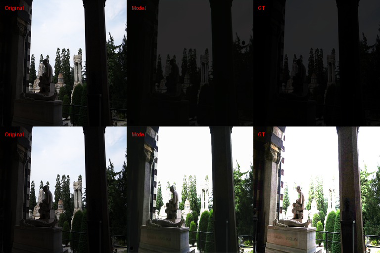

### C41
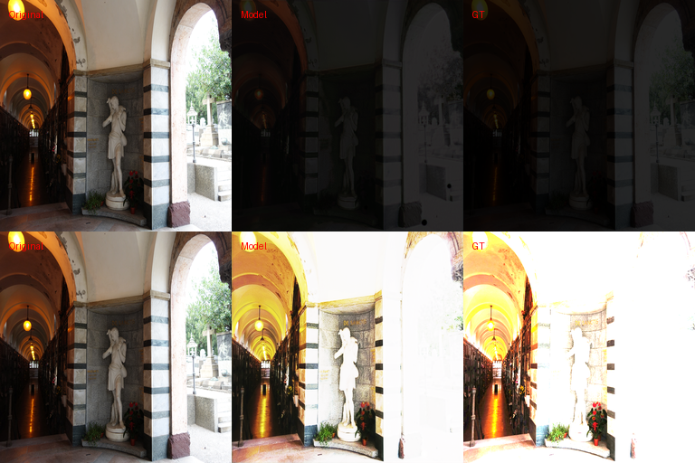

### C42
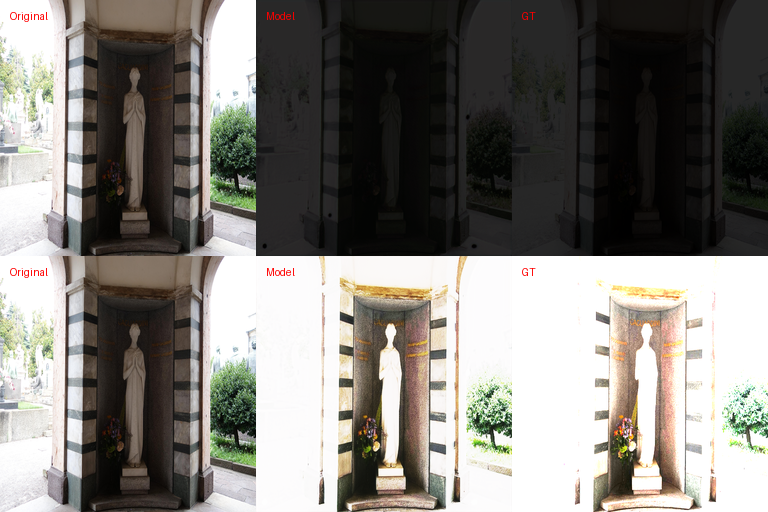

### C43
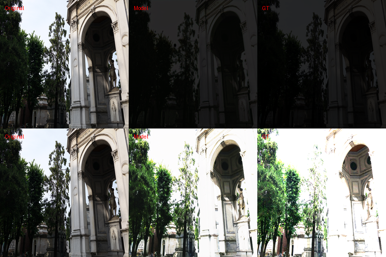

### C44
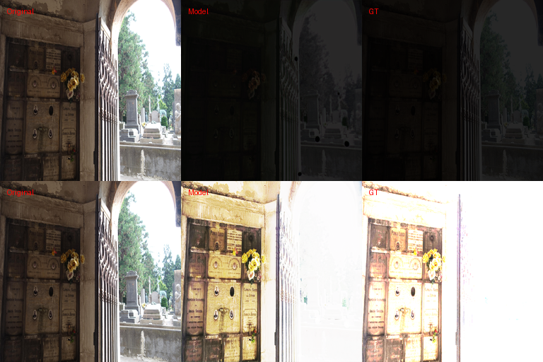

### C45
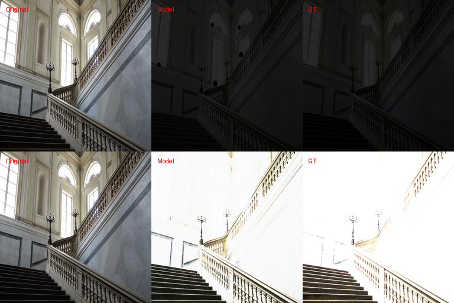

### C46
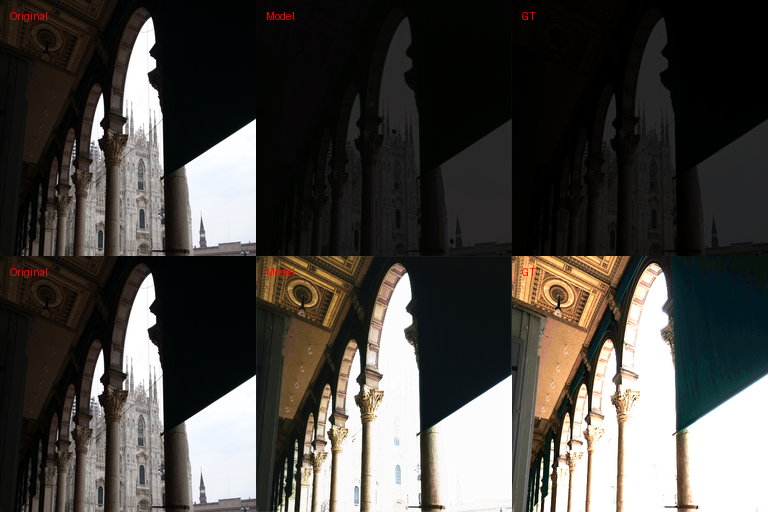

## Uwagi

- 4 sceny testowe (C42, C44, C45, C46) mają pliki z przycięciem (cropped) - brak metadanych EXIF, użyto domyślnych czasów ekspozycji
- Model trenowany na 14 scenach z poprawnym EXIF, bez przecieku danych train/test

## Autorzy

- Dawid Budzyński
- Filip Budzyński

---

## Eksperyment: Synteza danych 

### Metoda tworzenia danych syntetycznych

Wykorzystano technikę symetrii lustrzanych w celu zwiększenia zbioru danych treningowych:

- **Oryginalne sceny z EXIF**: 17 scen
- **Oryginalne zdjęcia**: ~130
- **Po augmentacji**: ~520 zdjęć (4x więcej)
- **Wzrost danych treningowych**: 130 → 520 (+300%)

### Wyniki modelu z danymi syntetycznymi

#### Tabela 1: Ekspozycja (model syntetyczny)

| Metoda | PSNR | LPIPS |
|-------|-----|-------|
| underexposed | 38.16 | 0.087 |
| overexposed | 15.38 | 0.409 |

#### Tabela 2: Ekspozycja per scena (model syntetyczny)

| Scena | Underexposed | Overexposed |
|-------|-------------|------------|
| C40 | 38.35 | 14.51 |
| C41 | 38.08 | 14.19 |
| C42 | 38.38 | 17.64 |
| C43 | 38.16 | 12.57 |
| C44 | 38.44 | 21.69 |
| C45 | 38.25 | 15.26 |
| C46 | 37.43 | 11.81 |

### Porównanie modeli

| Model | Underexposed PSNR | Overexposed PSNR |
|-------|------------------|-----------------|
| Bazowy (130 próbek) | 36.18 | 18.80 |
| Syntetyczny (520 próbek) | 38.16 | 15.38 |

### Podsumowanie

- **Underexposed**: Model syntetyczny **+1.98** lepszy (38.16 vs 36.18)
- **Overexposed**: Model bazowy **-3.42** lepszy (18.80 vs 15.38)

**Wnioski:**
- Augmentacja poprawiła wyniki dla underexposed (+2 dB)
- Dla overexposed wyniki pogorszyły się - model może nadmiernie dopasowywać się do wzorców z odbić lustrzanych
- Potrzebne są dalsze eksperymenty z innymi technikami augmentacji

### Wizualizacje modelu na danych syntentycznych

#### C40
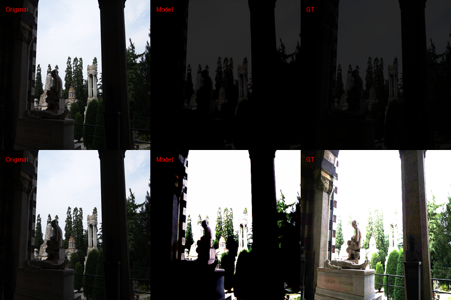

#### C41
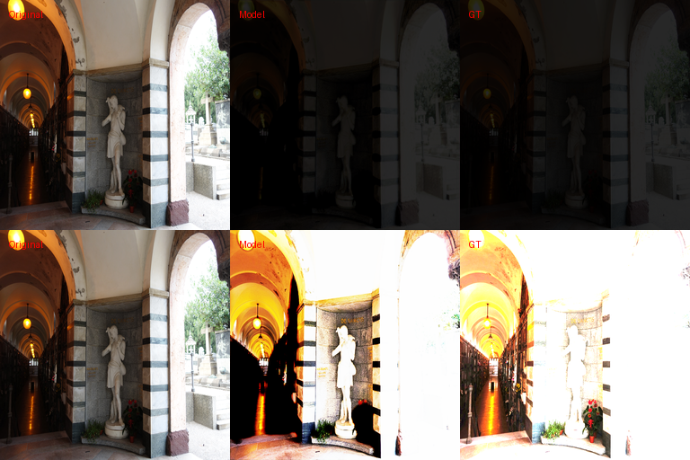

#### C42
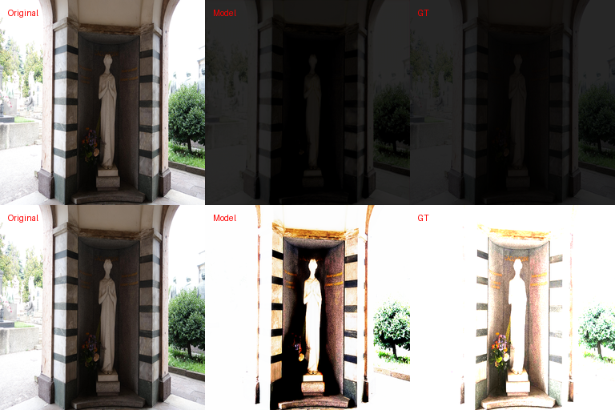

#### C43
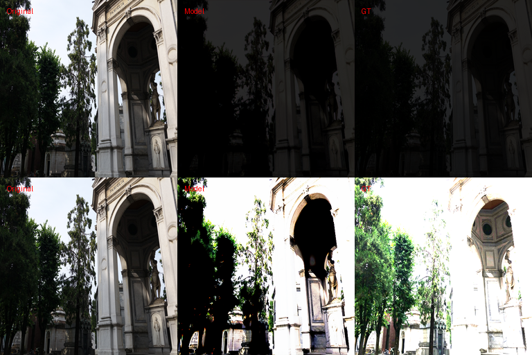

#### C44
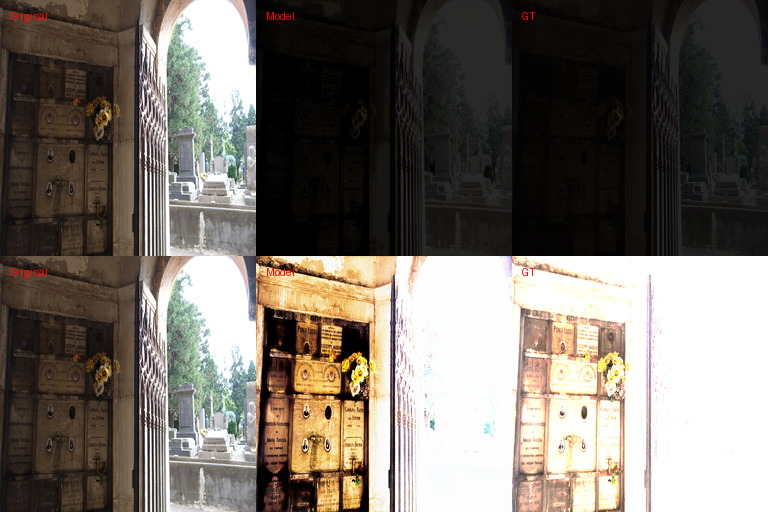

#### C45
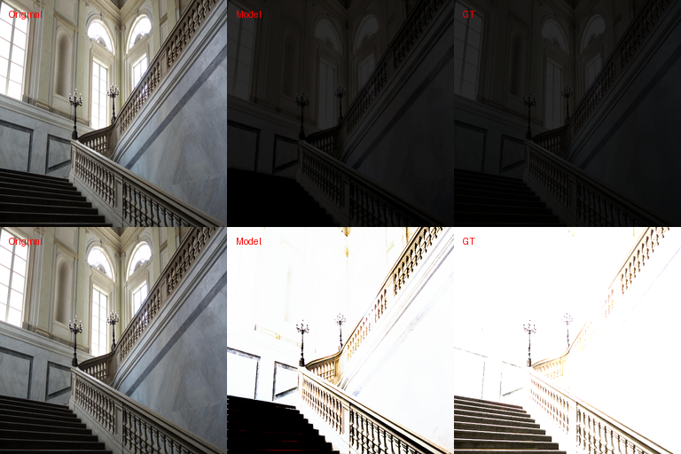

#### C46
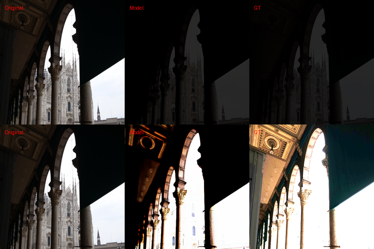

