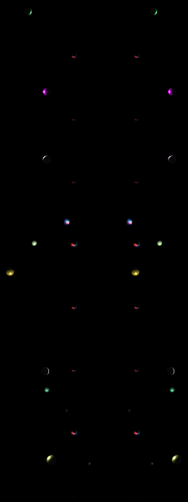
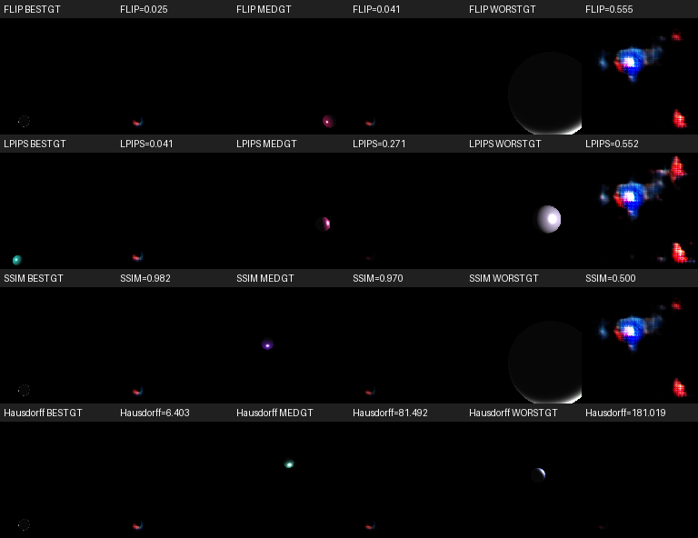
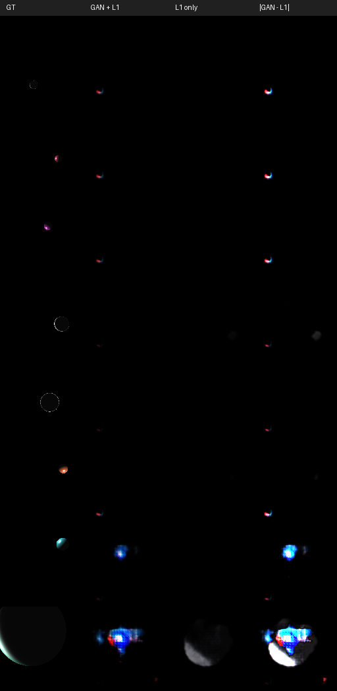

# SIGK26 Projekt 3 — Renderer neuralny (model Phonga)

**Autorzy:** Dawid Budzyński, Filip Budzyński (grupa 10)

Sieć typu **conditional GAN** (pix2pix-style), która z 15-wymiarowego wektora
parametrów sceny generuje 128×128 obraz kuli oświetlonej modelem Phonga.

---

## Instalacja

```bash
poetry install -C lab3                # dependencies (torch, lpips, flip-evaluator, moderngl, ...)
poetry env activate
```

W repozytorium używamy też istniejącego `.venv`:

```bash
source .venv/bin/activate
python -m pip install moderngl PyWavefront pyrr lpips flip-evaluator
```

---

## Uruchomienie

```bash
# 1. Wygeneruj zbiór 3000 obrazów 128×128 z dostarczonego renderera
python lab3/generate_dataset.py --out lab3/data --n 3000

# 2. Trenuj główny model (cGAN + L1)
python lab3/train.py --epochs 80 --batch_size 64

# 3. Ewaluacja na 600 obrazach testowych (FLIP/LPIPS/SSIM/Hausdorff)
python lab3/evaluate.py
```

Eksperymenty pomocnicze:

```bash
# L1-only (bez członu adwersarialnego)
python lab3/train.py --epochs 80 --no_gan --out lab3/checkpoints/l1_only.pt
python lab3/evaluate.py --ckpt lab3/checkpoints/l1_only.pt --out_dir lab3/results/l1_only

# Kodowanie absolutne pozycji (zamiast względem kamery)
python lab3/train.py --epochs 80 --encoding absolute --out lab3/checkpoints/abs_encoding.pt
python lab3/evaluate.py --ckpt lab3/checkpoints/abs_encoding.pt --out_dir lab3/results/abs_encoding

# Analiza dystrybucji metryk + porównanie modeli
python lab3/scripts/analyze_metrics.py
python lab3/scripts/compare_models.py
```

---

## Generacja zbioru danych

Korzystamy z **dostarczonego renderera** (`SIGK___Projekt_3/resources/shaders/phong/`,
`sphere.obj`) tylko offscreenowo: tworzymy `moderngl.create_standalone_context()`
i renderujemy do FBO 128×128 dokładnie tym samym kodem GLSL co aplikacja
okienkowa. Stałe `material_ambient=[76,76,76]/255`, `light_ambient=[25,25,25]/255`,
`material_specular=light_specular=light_diffuse=[255,255,255]/255` — zgodnie ze
specyfikacją.

Losowane parametry per scena (sec. 2.3 specyfikacji):

| Parametr             | Zakres            |
|----------------------|-------------------|
| obj_pos (xyz)        | `[-20, 20]³`      |
| diffuse (rgb)        | `[0, 255]³`       |
| shininess            | `[3, 20]`         |
| light_pos (xyz)      | `[-20, 20]³`      |
| kamera (stała)       | `(5, 5, 15)`, FOV 45°, lookAt = (0,0,0) |

### Kluczowy problem (wskazówka #2 spec)

Z `[-20, 20]³` znaczna część losowanych pozycji **całkowicie wypada poza kadr** —
kula jest za kamerą lub poza frustum. Pierwsze 12 prób w naïvnej wersji dało 11
zupełnie czarnych obrazów. Rozwiązanie: **rejection sampling** w
`is_visible()` — projektujemy środek kuli do clip-space i akceptujemy jeśli
NDC.x, NDC.y ∈ [-0.85, 0.85] i głębokość kamery w [3, 30]. Zostaje rozproszenie
po pozycji w obrazie (kula nie zawsze pośrodku — wskazówka #3) bez czarnych
przykładów.

### Kodowanie wejściowe (wskazówka #1 spec)

Pozycje są kodowane **względem kamery** (a nie w światowym układzie):
`(obj_pos - cam) / 30`. Dodatkowo dodajemy odległość do kamery oraz `sin/cos`
azymutu i elewacji obiektu. Dzięki temu generator nie musi się uczyć stałej
transformacji widoku — uczy się tylko shadingu w przestrzeni ekranu.

Łącznie: 15-wymiarowy wektor (3 obj_rel + 3 light_rel + 3 RGB + 1 shininess +
1 dist + 2 azymut + 2 elewacja).

---

## Architektura modelu

**Generator** (`models/neural_renderer.py:Generator`)

```
params(15) → MLP → 4×4×512 → 5× (ConvTranspose 4, stride 2 + BN + ReLU)
                                       → 8 → 16 → 32 → 64 → 128
            → Conv 3×3 → Sigmoid → 3×128×128
```

**Discriminator** — PatchGAN 70×70 z **conditioningiem** na parametrach (rozszerzamy
wektor parametrów do mapy stałej i konkatenujemy z obrazem). Dyskryminator ocenia
"czy ten obraz pasuje **do tych parametrów**", a nie tylko "czy to dowolny Phong".

**Funkcja straty:**
```
L_G = L_GAN(D(G(x), x), 1) + λ * L1(G(x), y)
L_D = ½(BCE(D(y, x), 1) + BCE(D(G(x), x), 0))
```
gdzie λ = 100, optimizer Adam(2e-4, β=(0.5, 0.999)), 80 epok, batch 64. Trening
~22 minut na pojedynczym GPU.

---

## Wyniki — tabela główna

Ewaluacja na 600 obrazach testowych (20% zbioru). Niższe lepsze dla
FLIP/LPIPS/Hausdorff, wyższe lepsze dla SSIM:

| Metoda                      | FLIP ↓   | LPIPS ↓  | SSIM ↑   | Hausdorff ↓ |
|-----------------------------|----------|----------|----------|-------------|
| **neural_renderer (cGAN, relatywne)** | 0.0612   | 0.2677   | 0.9574   | 89.22       |
| L1-only (bez adwersaria)    | 0.0273   | 0.2142   | 0.9748   | 174.65      |
| cGAN, encoding absolutny    | 0.0663   | 0.2207   | 0.9555   | 61.91       |

Wartości pochodzą z `lab3/results/metrics_summary.md` (uruchamiane przez
`evaluate.py`).

### Per-metryka percentyle (cGAN, 600 testów)

| Metryka  | min    | p10    | p50    | p90    | max    |
|----------|--------|--------|--------|--------|--------|
| FLIP     | 0.0246 | 0.0345 | 0.0412 | 0.1102 | 0.5546 |
| LPIPS    | 0.0413 | 0.1695 | 0.2710 | 0.3585 | 0.5516 |
| SSIM     | 0.5002 | 0.9299 | 0.9702 | 0.9747 | 0.9815 |
| Hausdorff| 6.40   | 35.6   | 81.4   | 181.0  | 181.0  |

---

## Wyniki wizualne

### Predykcja vs GT (8 typowych próbek z testu)

Lewy: GT, środek: predykcja generatora (cGAN+L1), prawy: różnica (×4 dla widoczności).



### Skrajne przypadki (best / median / worst per metryka)



Najgorszy przypadek dla wszystkich czterech metryk **to ta sama próbka** —
duża, blisko ustawiona kula gdzie generator wytwarza szum kolorowy zamiast
gładkiego cieniowania. Ten typ sceny występuje rzadko w zbiorze treningowym
(rejection sampling spycha rozkład w stronę kul średnio-odległych).

### cGAN vs L1-only

8 obrazów rozłożonych po jasności (lewy = bardzo małe kulki, dolny = duża blisko):



---

## Eksperymenty dodatkowe

### 1) Ablacja: L1-only vs L1 + GAN

Wytrenowaliśmy ten sam generator wyłącznie z L1 (bez dyskriminatora).

| Wariant          | FLIP ↓  | LPIPS ↓ | SSIM ↑  | Hausdorff ↓ |
|------------------|---------|---------|---------|-------------|
| L1-only          | 0.0273  | 0.2142  | 0.9748  | **174.65**  |
| cGAN + L1 (λ=100)| 0.0612  | 0.2677  | 0.9574  | **89.22**   |

**Obserwacja.** L1 bije cGAN we wszystkich metrykach _per-pixel_
(FLIP/LPIPS/SSIM), ale jest niemal **2× gorszy** w odległości Hausdorffa na
krawędziach Cannego.

**Wyjaśnienie.** L1 minimalizuje średni błąd i naturalnie prowadzi do "rozmytych"
predykcji — dla małych, jasnych refleksów daje się "zamazać" i wciąż mieć niski
średni błąd, ale Canny nie wykrywa wtedy żadnych krawędzi. Dla obrazu z brakiem
krawędzi Hausdorff zwraca przekątną kadru (181 px ≈ 128√2) jako fallback —
dlatego L1 ma medianę 174 a 90-tą percentyl 181 (połowa testów _nie ma_
krawędzi w predykcji L1!). Człon adwersarialny zmusza generator do produkowania
ostrzejszych krawędzi nawet kosztem niewielkiego wzrostu błędu pikselowego.

To jest dokładnie ten przypadek, w którym **inny zestaw metryk daje sprzeczne
oceny** — i to celna ilustracja pytania zadania:

> "Czy wszystkie metryki dobrze oddają jakość generowanych obrazów?"

### 2) Ablacja: kodowanie pozycji (relatywne vs absolutne)

Spec wskazówka #1 sugerowała "relatywne zapisanie pozycji". Wytrenowaliśmy
identyczny model z kodowaniem **absolutnym** (raw `obj_pos / 20`,
`light_pos / 20`, bez współrzędnych sferycznych).

| Wariant                 | FLIP ↓  | LPIPS ↓ | SSIM ↑  | Hausdorff ↓ |
|-------------------------|---------|---------|---------|-------------|
| Relatywne + sin/cos     | 0.0612  | 0.2677  | 0.9574  | 89.22       |
| Absolutne (xyz / 20)    | 0.0663  | **0.2207** | 0.9555 | **61.91** |

**Wynik wbrew hipotezie.** Spodziewaliśmy się, że relatywne kodowanie wygra,
ponieważ "podajemy generatorowi wiedzę o kamerze". W praktyce wersja z
absolutnym xyz **wygrała w LPIPS i Hausdorffie** (i była tylko nieznacznie
gorsza w FLIP/SSIM).

Prawdopodobne wyjaśnienie: w wersji relatywnej cechy `obj_rel` i `(sin az,
cos az, sin el, cos el)` są ze sobą silnie skorelowane (te drugie są
deterministyczną funkcją tych pierwszych), więc generator dostaje redundantne
wejście, a rzeczywista geometria jest "rozproszona" po kilku skorelowanych
kanałach. Sieć z absolutnym xyz może się natomiast nauczyć **swojego**
optymalnego rzutowania od zera. Lekcja: dla zadania, w którym sieć dysponuje
wystarczającą pojemnością i danymi, **nadmiarowe ręczne kodowanie może
zaszkodzić**, choć dla małych modeli/zbiorów wskazówka #1 wciąż ma sens.

---

## Czy wszystkie metryki dobrze oddają jakość?

Krótka odpowiedź: **nie wszystkie, i każda mierzy coś innego**.

- **SSIM** jest tu mało użyteczny: ~95% pikseli jest czarnych, więc nawet
  predykcja "wszystko czarne" daje SSIM ≈ 0.94 (patrz percentyl p10). Mediana
  0.97 dla cGAN i 0.97 dla L1 wygląda imponująco, ale w rzeczywistości oba
  modele różnią się znacząco wizualnie. SSIM jest zdominowany przez tło.

- **FLIP** jest bardziej selektywny — kara za różnicę kolorów highlightów jest
  widoczna (cGAN 0.06 vs L1 0.03), ale wciąż uśredniony po pikselach więc
  niedostatecznie dyskryminuje "rozmycie".

- **LPIPS (AlexNet)** ocenia podobieństwo perceptualne — tu, jak FLIP, premiuje
  L1 (0.21 < 0.27 cGAN), bo AlexNet "widzi" rozmytą kulkę jako bliską GT.
  Klasyk: LPIPS bywa optymistyczny dla rozmytych wyjść.

- **Hausdorff na krawędziach Cannego** odwraca uporządkowanie i pokazuje że
  L1 "zgubił krawędzie". Ta metryka jest **bardzo wrażliwa** na pojedynczy
  outlier (1 piksel daleko = duża wartość) i na fallback gdy obraz nie ma żadnej
  krawędzi (181 px). Dlatego nasza implementacja zwraca przekątną kadru w tym
  przypadku zamiast `inf` (`utils/metrics.py:hausdorff_score`).

**Wniosek praktyczny.** Pojedyncza metryka tu jest niewystarczająca. Tylko
łącznie SSIM/FLIP/LPIPS/Hausdorff dają obraz w którym widać że cGAN poprawia
ostrość (Hausdorff) kosztem dokładności pikselowej (FLIP/LPIPS), a wybór celu
(ostrość vs gładkość) zależy od zastosowania.

---

## Struktura katalogu

```
lab3/
├── generate_dataset.py        # offscreen renderer (moderngl standalone)
├── train.py                   # cGAN training (--no_gan, --encoding flagi ablacji)
├── evaluate.py                # FLIP/LPIPS/SSIM/Hausdorff na 600 testach
├── pyproject.toml
├── README.md
├── models/
│   ├── __init__.py
│   └── neural_renderer.py     # Generator + PatchGAN Discriminator
├── utils/
│   ├── __init__.py
│   ├── dataset.py             # encode_params (relatywne) / _absolute
│   └── metrics.py             # FLIP, LPIPS, SSIM, Hausdorff
├── scripts/
│   ├── analyze_metrics.py     # best/median/worst per metryka
│   └── compare_models.py      # cGAN vs L1 montage
├── checkpoints/               # *.pt (pomijane w git via .gitignore)
├── data/                      # 3000× 00000.png + labels.json
└── results/
    ├── qualitative_montage.png
    ├── metric_extremes.png
    ├── compare_gan_vs_l1.png
    ├── metrics_summary.md
    └── metrics_per_sample.csv
```
