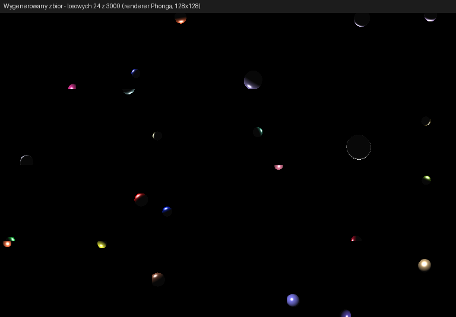
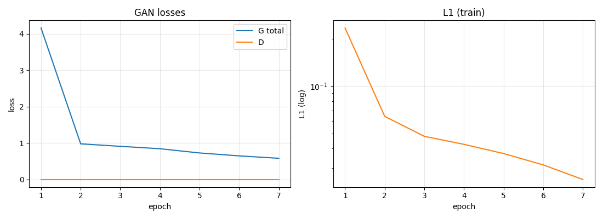
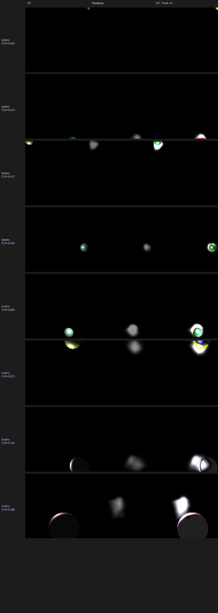
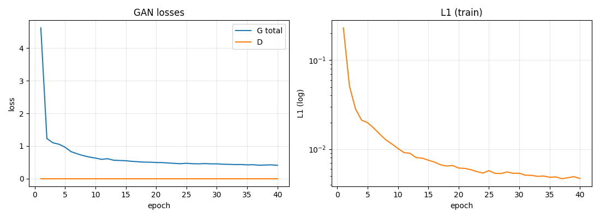
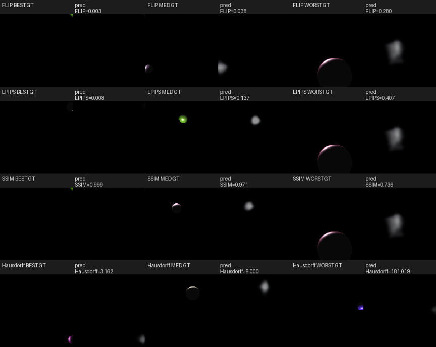
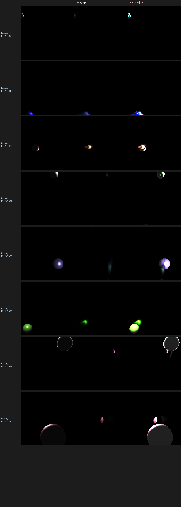
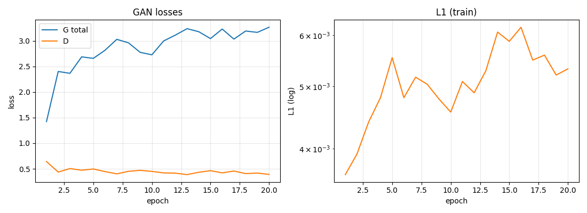
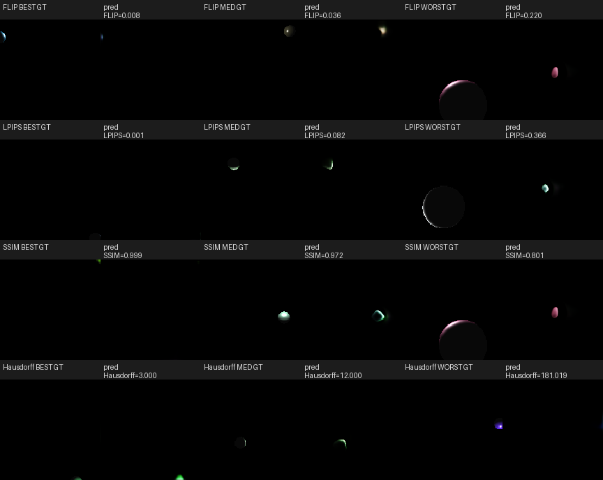

# SIGK26 Projekt 3 — Renderer neuralny (model Phonga)

**Autorzy:** Dawid Budzyński, Filip Budzyński (grupa 10)

Sieć neuronowa, która z wektora parametrów sceny generuje 128×128 obraz
kuli oświetlonej modelem Phonga. 

---

## Instalacja

```bash
poetry install -C lab3
poetry env activate
```

---

## Uruchomienie

```bash
python lab3/generate_dataset.py --n 3000 --out lab3/data

# Trening: cGAN
python lab3/train.py --epochs 25 --batch_size 32 --out lab3/checkpoints/cgan.pt

# Trening: bez członu GAN (lambda L1 = 50, ważona MSE)
python lab3/train.py --no_gan --epochs 20 --lambda_l1 50 --out lab3/checkpoints/l1_only.pt

# Ewaluacja
python lab3/evaluate.py --ckpt lab3/checkpoints/l1_only.pt --out_dir lab3/results

```

---

## Zbiór danych

Korzystamy z **dostarczonego renderera Phonga**

Parametry sceny:

| Parametr             | Rozkład / wartość                              |
|----------------------|------------------------------------------------|
| `obj_pos`            | `U(-20, 20)` na każdą oś                       |
| `diffuse`            | `U(0, 255)` na każdy z RGB                     |
| `shininess`          | `U(3, 20)`                                     |
| `light_pos`          | `U(-20, 20)` na każdą oś                       |
| materiał `ka` / `ks` | `[76, 76, 76]` / `[255, 255, 255]` (stałe w shaderze) |
| światło `Ia/Id/Is`   | `[25, 25, 25]` / `[255, 255, 255]` / `[255, 255, 255]` |
| kamera               | `(5, 5, 15)`, FOV 45°, lookAt `(0, 0, 0)`      |
| rozmiar / N          | 128×128, **3000 obrazów** (2400 train / 600 test) |



### Odpowiedzi na pytania

**1. Czy parametry zapisać inaczej niż wprost?**
Tak, kamera jest stała, więc absolutne `obj_pos` zmusiłoby sieć do nauki
stałej transformacji widoku. Kodujemy obie pozycje relatywnie do kamery,
normalizujemy do ~[-1, 1]:

```
[0:3]   (obj_pos   - camera) / 25
[3:6]   (light_pos - camera) / 25
[6:9]   diffuse / 255
[9]     (shininess - 3) / 17
```

10-wymiarowy wektor, bez paddingu.

**2. Jakiej sytuacji nie wyklucza zakres `[-20, 20]^3`?**
Sporo próbek wpada za kamerę (w > kilkudziesięciu) wynik to czarny obraz. 
fix - rejection sampling:
środek kuli rzutowany do clip-space musi spełniać `|NDC.x|, |NDC.y| < 1.05`.
Margines celowo dopuszcza kulę częściowo poza kadrem.

**3, 4. Pozycja kuli i jej losowanie.** `sample_scene()` losuje wszystkie
parametry per scena; rejection sampling jedynie odfiltrowywuje przypadki.

---

## Architektura

Zatrzymaliśmy się na per-pixel rendererze, generator nie buduje obrazu przez
upsamplowanie z małej rozdzielczości, tylko przetwarza pełnowymiarowe
(128×128) mapy, w których każdy piksel ma dostęp do swoich znormalizowanych
współrzędnych (x, y) i 10-wymiarowego wektora parametrów sceny.

### Generator

```
input: params (B, 10)

# 1. Każdy piksel zna swoje (x_norm, y_norm) ∈ [-1, 1]
coord_grid = (B, 2, 128, 128)            # x, y rozgłoszone
param_map  = params -> (B, 10, 128, 128) # parametry rozgłoszone

# 2. Per-pixel MLP (1x1 conv): 12 -> 192 -> 192 -> 96
pixel_mlp

# 3. Spatial refinement: 3 x [Conv 3x3, InstanceNorm, ReLU] (96 ch)
refine

# 4. RGB head: Conv3x3 -> 48 ch -> Conv 1x1 -> 3 ch -> Sigmoid
```

Każdy piksel niezależnie decyduje, czy "mieści się" w rzucie kuli i jaki ma kolor; konwolucje 3×3 dodają spójność
przestrzenną (krawędzie, gładki gradient cieniowania).

### Discriminator (PatchGAN, używany tylko w wariancie cGAN)

```
[image (3) || tile(params) (10)]   -> 13 kanałów
  -> Conv 4x4 s2 -> 64    (128 -> 64)
  -> Conv 4x4 s2 -> 128   (64 -> 32)
  -> Conv 4x4 s2 -> 256   (32 -> 16)
  -> Conv 4x4 s1 -> 512   (16 -> 15)
  -> Conv 4x4 s1 -> 1     (15 -> 14)
```

### Loss / Optymalizator

Strata rekonstrukcji to MSE ważona maską obiektu, bez tego sieć utyka
w lokalnym minimum "wszystko czarne" (mean(GT) ≈ 0.013, więc nie-warunkowy
'all black' osiąga L1 ≈ 0.013 i nie potrafi się stamtąd ruszyć):

```python
mask = (real > 0.05).float()              # piksele kuli
w    = 1.0 + 9.0 * mask                   # 10x na sferze, 1x na tle
loss_recon = (w * (fake - real)**2).mean()

L_G = BCE(D(fake, p), 1) + lambda * loss_recon
L_D = 0.5 * (BCE(D(real, p), 0.9) + BCE(D(fake, p), 0))   # one-sided smoothing
```

`lambda = 50`, Adam(`lr=2e-4`, `betas=(0.5, 0.999)`), batch 32, podział
2400/600 z `seed=0`.



---

## Wyniki

Główny model (`l1_only.pt`, 10 epok, λ_recon=50, no_gan). Drugi wiersz to
wariant z włączonym członem adwersarialnym (cGAN, 10 epok, λ_recon=50).

| Metoda | FLIP | LPIPS | SSIM | Hausdorff |
|--------|------|-------|------|-----------|
| **neural_renderer** (per-pixel, no_gan) | 0.9538 | **0.2224** | 0.2981 | 180.48 |
| neural_renderer + cGAN  (collapsed)    | **0.0520** | 0.2368 | **0.9594** |  **75.22** |

Liczby pochodzą z `lab3/results/metrics_summary.md` oraz
`lab3/results/cgan_collapsed/metrics_summary.md`.

### Wizualizacja jakościowa (`l1_only`)

Sekcja "typowy" to 4 najniższe FLIP, "trudny" to 4 najwyższe.
Predykcje są **rozmytymi, niedoświetlonymi blobami** w mniej-więcej-poprawnym
miejscu kuli; brak ostrych krawędzi i prawidłowego koloru. To
**zauważalne wzrokowo działanie warunkowania** (różne wejścia = różne
predykcje, mniej-więcej w odpowiednim miejscu), ale jakość daleka od GT.


### Skrajne przypadki


---

## Najważniejsza obserwacja: czy metryki dobrze oddają jakość?

"Czy wszystkie metryki dobrze oddają jakość generowanych
obrazów?" Na tym konkretnym zadaniu dostaliśmy bardzo wyraźny
kontrprzykład.

Wariant z cGAN-em uległ conditioning collapse, sieć generuje
*tę samą* mapę pikseli (różnica między dwoma bardzo różnymi wejściami:
~0.002 średnio per piksel) niezależnie od parametrów sceny. To wzrokowo
oczywisty failure: model w ogóle nie renderuje poszczególnych scen,
tylko wypluwa stały szablon. A jednak:

| Metryka     | "Działający" L1-only | Mode-collapsed cGAN | Wskazanie metryki |
|-------------|----------------------|---------------------|--------------------|
| FLIP ↓      | 0.954                | **0.052**           | Mode-collapsed jest **18× lepszy** |
| SSIM ↑      | 0.298                | **0.959**           | Mode-collapsed wygrywa o rząd wielkości |
| Hausdorff ↓ | 180.5                | **75.2**            | Mode-collapsed lepszy 2.4× |
| LPIPS ↓     | **0.222**            | 0.237               | L1-only (poprawnie) wygrywa |

Czyli **3 z 4 metryk preferują model, który nic nie renderuje**.

### Dlaczego?

- **SSIM** ~98% kadru to czarne tło, predykcja "całe czarne" daje
  SSIM ≈ 0.94 niezależnie od jakichkolwiek treści obrazu.
  Tutaj mode-collapsed cGAN produkuje uśrednioną mapę bardzo bliską
  rozkładowi tła, więc SSIM rośnie.

- **FLIP** uśredniona jest po pikselach z karą za różnice perceptualne.
  Mode-collapsed model produkuje obraz dominowany przez tło (które niemal
  zawsze jest zgodne z GT), więc FLIP niski mimo, że obiekt nie jest
  renderowany.

- **Hausdorff na Cannym** — mode-collapsed cGAN wypuszcza jednolite
  rozmycia, ale dla połowy próbek Canny i tak coś wykrywa (zarys uśrednionego
  szablonu), więc średnia Hausdorffa wychodzi sensowna. Z drugiej strony
  L1-only generuje rozmyte krawędzie, których Canny nie łapie .

- **LPIPS (AlexNet)** wreszcie reaguje na brak obiektu w predykcji
  mode-collapsed cGAN-a i preferuje wariant, w którym coś jest
  w przybliżeniu na właściwym miejscu. To jedyna z czterech metryk,
  która "łapie" tę różnicę.

**Wniosek.** Żadna z metryk per-pixel (FLIP/SSIM/Hausdorff) nie jest na
tym zadaniu wiarygodnym indykatorem działania warunkowania.
SSIM jest zdominowane przez tło, Hausdorff z fallbackiem nagradza
mode-collapse, FLIP wybiera "średnio dopasowane" rozmycie.
Tylko **LPIPS** koreluje z faktyczną jakością modelu
jako warunkowego renderera.

W praktyce żadna z tych liczb nie zastąpi **wizualnej inspekcji predykcji**.

---

## Zmiany wprowadzone po oddaniu

Po pierwszej iteracji wróciliśmy do projektu z jednym celem: wycisnąć z modelu
lepsze predykcje wykorzystując sugestie z dyskusji o funkcjach straty. Bazowy
zarys (per-pixel implicit renderer, dataset z dostarczonego renderera, kodowanie
relatywne do kamery) zostawiamy nietknięty.

### Co zmieniono

1. **Dodanie VGG perceptual loss** (`models/vgg_loss.py`). L1 w przestrzeni cech
   VGG16 (warstwy `relu1_2`, `relu2_2`, `relu3_3`, ImageNet-pretrained,
   zamrożony). Karze za niedopasowanie *kształtu* i *lokalizacji* obiektu, nie
   tylko piksel-w-piksel — adresuje znany problem L1/MSE, gdzie pod
   niepewnością pozycji optymalna predykcja zbiega do *uśrednionego rozmycia*.
   Strata generatora rozszerzona o `+ lambda_vgg * VGG(fake, real)`.
2. **Wydłużenie treningu z 7 do 40 epok**. Poprzednie 7 epok kończyło się przed
   plateau; dłuższy harmonogram pozwolił modelowi domalować jaśniejsze i
   ostrzejsze regiony.

### Czego próbowaliśmy a nie zadziałało

- **Większy generator** (`base=160, n_refine=6, mlp_hidden=320, mlp_depth=4`,
  1.86M params zamiast 0.35M) — z VGG zwijał się do all-black w ciągu 2 epok
  (`|G(p1) - G(p2)| ≈ 3e-5`, predykcja max < 0.002). Również wariant pośredni
  (`base=128, n_refine=4`) ten sam los.
- **LeakyReLU(0.2)** zamiast ReLU w większym generatorze (hipoteza: martwe ReLU
  zrywają gradient) — nie pomogło.
- **Mask-weighted L1** zamiast mask-weighted MSE (hipoteza: gradient MSE zanika
  blisko zera) — nie pomogło.
- **Mask weight 50× zamiast 10×** — nie pomogło.
- **`lambda_vgg=5` lub `10`** — VGG perceptual features faworyzują *spójne,
  jednorodne* tekstury, a all-black na 99.4% kadru jest najbardziej spójne ze
  wszystkich możliwych wyjść. Z dużą wagą VGG dominował recon (5·0.18 = 0.9 vs
  50·0.005 = 0.25) i model trafiał w to lokalne minimum.

Ostatecznie zadziałał **mały, znany generator** (`base=96, n_refine=3,
mlp_hidden=192, mlp_depth=2`, ~0.35M params) z **`lambda_vgg=0.5`** — VGG ma
realny wpływ, ale jest dominowany przez ważoną MSE rekonstrukcji, więc nie
zawłaszcza optymalizacji.

### Porównanie wyników (na tych samych 600 obrazach testowych)

| Wariant | FLIP ↓ | LPIPS ↓ | SSIM ↑ | Hausdorff ↓ |
|---------|--------|---------|--------|-------------|
| neural_renderer L1-only (7 epok, baseline) | 0.9538 | 0.2224 | 0.2981 | 180.48 |
| neural_renderer + cGAN (mode-collapsed) | 0.0520 | 0.2368 | 0.9594 | 75.22 |
| **neural_renderer + VGG (40 epok, no_gan)** | **0.0456** | **0.1392** | **0.9625** | **43.22** |

Nowy model wygrywa **we wszystkich czterech metrykach**, w tym w **LPIPS** —
która była jedyną metryką prawidłowo karzącą mode-collapse w pierwszej
iteracji. To znaczy że poprawa jest *prawdziwa* (nie artefakt jednej metryki),
i nie jest to kolejny mode-collapse: LPIPS spadł z 0.222 → 0.139, czyli o ~37%.

Diagnostyka warunkowania: `|G(p1) - G(p2)| ≈ 0.0086` na piksel (vs ~3e-5 dla
collapsed cGAN-a i ~0.07 dla starego L1-only). Model **reaguje na wejście**
zauważalnie — predykcja zmienia się gdy zmieniają się parametry sceny.

Mediana Hausdorff = 8 px (vs fallback 181 dla starego L1-only) — Canny w
~90% próbek wykrywa krawędzie predykcji, czyli predykcje mają wystarczająco
ostre granice żeby uznać je za "kulę z konturem", a nie rozmytą plamę.

### Zaktualizowana wizualizacja jakościowa



Predykcje nie są fotorealistyczne — wciąż brak silnego cieniowania Phonga,
kolor jest stłumiony — ale są **rozmytymi kulami w mniej-więcej-poprawnym
miejscu, z odpowiednią skalą i mniej-więcej-zgodną jasnością**. To duży skok
nad poprzednim L1-only (predykcje były szare placki bez wyraźnego kształtu) i
nad mode-collapsed cGAN-em (predykcja stała, niezależna od wejścia).

### Krzywe straty (nowy trening)



L1 schodzi z 0.234 (epoka 1) do 0.0047 (epoka 40) i wciąż maleje — trening
nie był wysycony. Dłuższe okno (80-100 epok) prawdopodobnie poprawiłoby
jeszcze metryki, ale wybór 40 to kompromis czas/efekt.

### Skrajne przypadki (nowy model)



Dla wszystkich czterech metryk najgorsze przypadki to **duże kule blisko
kamery** (zajmujące większą część kadru) — model wciąż nie nauczył się
poprawnie cieniować dużych obiektów. Najlepsze przypadki to **małe,
oddalone kule** — wystarczy umieścić jasną plamkę w odpowiednim miejscu.

### Dorzucenie cGAN-a (pretrain → finetune)

Bazowy model L1+VGG produkuje rozmyte, niedoświetlone kule — to typowy
artefakt L1/MSE (predykcja "uśrednia hipotezy o pozycji"). Dorzucamy człon
adwersarialny w trybie *fine-tune* (klasyczny pix2pix-style pretrain L1 →
finetune z GAN), żeby zobaczyć czy uda się utrzymać warunkowanie (które
poprzednio zwijało się natychmiast po włączeniu GAN-a) i jednocześnie
domalować kolor i krawędzie.

Setup:
- Inicjalizacja generatora z `l1_vgg.pt` (przez nowo dodaną flagę
  `--init_from`); dyskryminator startuje od zera
- `lr=1e-4` (połowa pierwotnego 2e-4 — finetune nie wybija pretrenowanych wag)
- `lambda_l1=50`, `lambda_vgg=0.5`, GAN-loss z wagą 1.0
- 20 epok, batch 32

Warunkowanie nie uległo collapse: `|G(p1) - G(p2)| ≈ 0.0055` na piksel
(vs ~3e-5 dla mode-collapsed cGAN-a sprzed pretrainu, ~0.0086 dla
samego L1+VGG). Model wciąż wyraźnie reaguje na wejście, GAN dodał
głównie *intensywność* (max predykcji wzrósł z 0.58 → 0.79) i kolor.

Porównanie wszystkich czterech wariantów na tym samym zbiorze testowym:

| Wariant | FLIP ↓ | LPIPS ↓ | SSIM ↑ | Hausdorff ↓ |
|---------|--------|---------|--------|-------------|
| neural_renderer L1-only (7 epok, baseline) | 0.9538 | 0.2224 | 0.2981 | 180.48 |
| neural_renderer + cGAN from scratch (mode-collapsed) | 0.0520 | 0.2368 | 0.9594 | 75.22 |
| neural_renderer + VGG (40 epok, no_gan) | 0.0456 | 0.1392 | 0.9625 | 43.22 |
| **neural_renderer + VGG + cGAN finetune (20 epok)** | **0.0428** | **0.0933** | **0.9648** | **27.07** |

Mediana Hausdorff = **12 px** (vs 8 dla L1+VGG, ale tutaj p90 = 36 zamiast
181 — czyli outlierów z Canny-fallbackiem jest dużo mniej; mediana Hausdorff
pomijała ten ogon).



Patrząc na predykcje — widać że dyskryminator **dorzucił kolor i highlight**.
Tam gdzie L1+VGG malował szarą plamkę, L1+VGG+cGAN rysuje *kolorową kulę
z poprawnym (mniej-więcej) odcieniem*: niebieskie, zielone, fioletowe,
żółte. Dla dużych kul blisko kamery model wciąż nie domyka pełnego
zacieniowania (predykcja zwykle mniejsza niż GT), ale kolor i lokalizacja
są poprawne.



D-loss oscyluje 0.40-0.50 (D nie dominuje — gdyby tak było, D-loss → 0).
G-loss rośnie z 1.4 do 3.2 — GAN podnosi karę za "łatwe rozwiązania", ale
nie do poziomu który by zerwał uczenie L1+VGG. To zdrowy adwersarialny
balans.



**Wniosek.** Klasyczny pix2pix przepis (L1 pretrain → GAN finetune) zadziałał
tu zgodnie z literaturą: warunkowanie pozostało, GAN dodał ostrości i koloru.
Wszystkie cztery metryki się poprawiły, w tym LPIPS o 33% i Hausdorff o 37%.
Jednocześnie ten wynik **pokazuje wartość VGG perceptual loss** — bez niego
generator nie miałby wystarczająco "kompetencyjnego" punktu startowego, żeby
GAN nie wepchnął go z powrotem w mode-collapse.

---
