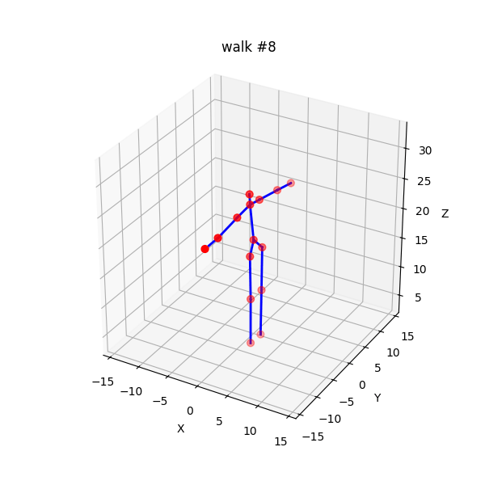
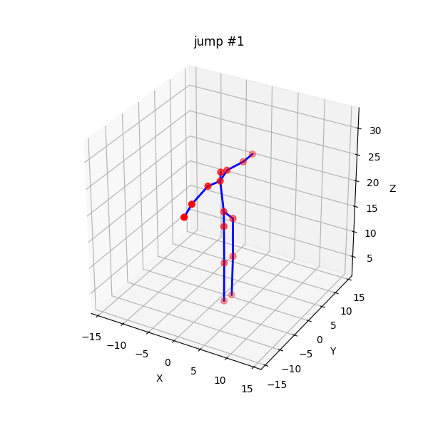
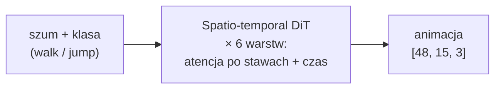

# SIGK26 grupa 10 (Dawid Budzyński, Filip Budzyński)

Projekt 5: generacja animacji stickmana modelem dyfuzyjnym (chód i skok).
Szkielet ma 15 stawów i 48 klatek, więc wyjściem jest tensor `[48, 15, 3]`.

## Instalacja

```bash
uv sync                     # synchronizuje .venv z pyproject.toml + uv.lock
source .venv/bin/activate   # opcjonalnie; można też uruchamiać przez `uv run ...`
```

## Wygenerowane animacje

**Chód (walk)**

<table>
<tr>
<td></td>
<td></td>
<td></td>
</tr>
</table>

**Skok (jump)**

<table>
<tr>
<td></td>
<td></td>
<td></td>
</tr>
</table>

## Wyniki (metryki)

| Ruch | FMD ↓ | MPJPE ↓ | Var (pairwise) ↑ |
|------|------:|--------:|-----------------:|
| walk | 6.28  | 1.67    | 4.56 |
| jump | 89.85 | 1.78    | 6.95 |

FMD i MPJPE liczymy względem zbioru testowego (root-relative), a wariancja mierzy
różnorodność próbek. Wysokie FMD skoku wynika głównie z małego zbioru testowego
(6 klipów daje prawie osobliwą macierz kowariancji), a nie z gorszej jakości ruchu.

## Reprezentacja

- **Reprezentacja kanoniczna** (`representation.py`): stawy poza miednicą są
  zapisane względem miednicy (korzenia) i obrócone do kanonicznego kierunku
  (ciało patrzy w `+X`); kanał miednicy niesie ruch korzenia
  `[prędkość pozioma x, y, wysokość z]`. Dzięki temu sieć uczy się **pozy**, a
  nie globalnego położenia i kierunku.
- **Normalizacja per-kanał**: każdy z 45 kanałów normalizujemy osobno, zamiast
  jedną wspólną wartością.
- **Sztywne kości**: `snap_bone_lengths` rzutuje każdą wygenerowaną klatkę na
  stałe długości kości, więc szkielet nie „oddycha”.

## Co zmieniliśmy po pierwszej iteracji

Pierwsza wersja działała na surowych pozycjach w przestrzeni świata i mimo
malejącej straty generowała zniekształcone szkielety o zmiennej długości kości.
Architektura i konfiguracja treningu pozostały bez zmian; poprawiliśmy tylko
reprezentację danych. Trzy zmiany według wpływu:

1. **Reprezentacja kanoniczna.** Oddzielenie globalnego położenia i kierunku od
   samej pozy. Sieć uczy się pozy oraz jednowymiarowego toru wysokości i prędkości,
   zamiast tej samej pozy w każdej orientacji świata.
2. **Stałe długości kości.** `snap_bone_lengths` zeruje zmienność długości kości
   (z 0.13 do 0.0 dla chodu), co odpowiada za większość poprawy wizualnej.
3. **Normalizacja per-kanał.** Wysokość miednicy, przesunięcia kończyn i prędkość
   roota mają różne skale, więc każdy kanał normalizujemy osobno.

## Eksperymenty

### Syntetyczne skoki (augmentacja danych)

Skoków jest mało (28 klipów wobec 56 chodu), więc dodaliśmy 120 syntetycznych
skoków tworzonych przez interpolację między prawdziwymi klipami (`synthesize.py`:
wyrównanie szczytu skoku, mieszanie w reprezentacji kanonicznej, wymuszenie
stałych kości). Hipoteza: większa pula skoków obniży FMD skoku. Oba modele
ocenione na tym samym zbiorze testowym i tym samym seedzie:

| Model | Ruch | FMD ↓ | (średnia + kowariancja) | MPJPE ↓ |
|-------|------|------:|:-----------------------:|--------:|
| baseline | jump | 96.99 | 36.2 + 60.8 | 1.721 |
| + syntetyczne | jump | 96.57 | 34.5 + 62.1 | **1.621** |

Wniosek: syntetyczne dane lekko poprawiły wierność pozy (MPJPE 1.72 do 1.62,
składnik średniej FMD 36 do 34.5), ale nie obniżyły FMD. FMD skoku jest
zdominowane przez składnik kowariancji (~61), który wynika z prawie osobliwej
macierzy kowariancji liczonej z zaledwie 6 klipów testowych. To ograniczenie
miary przy małym zbiorze testowym, a nie jakości ruchu, więc danych treningowych
nie da się tym naprawić.

### Wpływ „oddychania" szkieletu na metryki

Sprawdzamy, jak na metryki wpływa wymuszanie stałych długości kości
(`snap_bone_lengths`). Te same wygenerowane animacje oceniamy w dwóch
wariantach: ze sztywnym szkieletem (stałe długości kości) oraz bez tej korekty,
gdy kości mogą zmieniać długość między klatkami (szkielet „oddycha"). Prawdziwe
i wygenerowane animacje przetwarzamy tak samo, żeby porównanie było uczciwe.

| Ruch | Tryb | FMD ↓ | MPJPE ↓ | Zmienność długości kości |
|------|------|------:|--------:|-------------------------:|
| walk | sztywne kości        | **6.35** | **1.59** | 0.00 |
| walk | swobodne (oddycha)   | ~100     | 1.90     | 0.13 |
| jump | sztywne kości        | **88.4** | **1.89** | 0.00 |
| jump | swobodne (oddycha)   | 236.6    | 3.19     | 0.60 |

Wniosek: „oddychanie" (zmienna długość kości) silnie pogarsza metryki, bo wnosi
szum do pozycji stawów. Rzutowanie na stały szkielet jednocześnie zeruje tę
zmienność i poprawia FMD oraz MPJPE.

## Uruchomienie

```bash
# 1) przygotuj dane CMU MoCap z data/raw/{walk,jump}/*.bvh
uv run python -m src.stick_animation.prepare_data --raw-dir data/raw --out-dir data/stickanim_canon
# 2) trening i ewaluacja (zapisuje GIF-y oraz metrics_final.json)
uv run python train_stickanim.py --data-dir data/stickanim_canon --out-dir output/stickanim_canon --epochs 300
# 3) ewaluacja zapisanego checkpointu bez treningu
uv run python train_stickanim.py --data-dir data/stickanim_canon --skip-train --ckpt output/stickanim_canon/final.pt
```

## Decyzje projektowe

- **Hierarchiczna reprezentacja, miednica-root**. Lokalne pozycje są liczone
  względem miednicy, żeby model nie musiał uczyć
  się różnych orientacji świata oddzielnie.
- **Długości kości jako twardy invariant**.
  `snap_bone_lengths` rzutuje wynik do prawidłowych długości w kolejności BFS od
  miednicy.
- **Gałąź DCT**.
  Niskoczęstotliwościowe współczynniki DCT trafiają jako dodatkowe tokeny do
  warstwy temporalnej.
- **Skeleton attention bias.** Atencja przestrzenna dostaje dodatkowy logit
  `-dystans_w_grafie(j_a, j_b)`, więc bliższe stawy w drzewie kinematycznym
  domyślnie silniej się „widzą".
- **MPJPE / FMD / Var** liczone po
  reprezentacji root-relative, żeby nie dominowała globalna translacja.

## Architektura

Spatio-temporal Diffusion Transformer (DiT):



- Każdy blok DiT używa AdaLN-Zero -> projekcja
  conditioning-u na 6×D produkuje (shift, scale, gate)×2; gate=0 na starcie
  sprawia, że model = identyczność.
- Diffusion: `timesteps=1000`, cosine schedule, v-prediction; sampling
  DDIM (`n_steps=50`, η=0) + CFG (`guidance=3.0`); po samplingu
  `snap_bone_lengths`.
- Strata: `MSE(v_target, v_pred) + 0.1 · L_vel` (składnik prędkościowy).

## Dane

CMU MoCap, katalog `data/raw/{walk,jump}/`:
pliki `.bvh` z [`una-dinosauria/cmu-mocap`](https://github.com/una-dinosauria/cmu-mocap),
posegregowane według arkusza opisowego datasetu.

## Struktura katalogów

```
src/stick_animation/
  skeleton.py            # joint enum, hierarchia, kości, mirror, graf
  representation.py      # world <-> canonical, snap kości, DCT
  data_loader.py         # BVH -> [T, 15, 3]
  prepare_data.py        # split, augmentacja, normalizacja per-kanał, syntetyczne skoki
  dataset.py             # PyTorch Dataset
  diffusion.py           # cosine schedule, v/eps, DDIM, CFG
  losses.py              # MSE + velocity
  metrics.py             # FMD, MPJPE, Var
  sampling.py            # DDIM -> world -> snap kości
  synthesize.py          # syntetyczne skoki (interpolacja ruchu)
  visualize.py           # animate_skeleton_3d, grid_static
  models/spatiotemporal_dit.py

train_stickanim.py       # trening i ewaluacja
```
