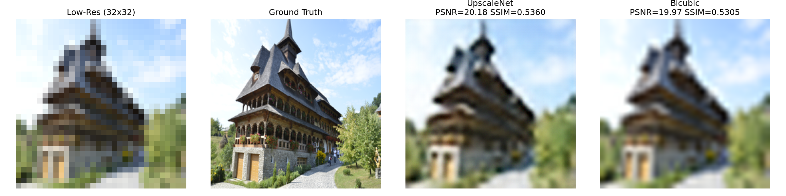

# Image Upscaling

Super-resolution model trained on DIV2K, comparing against bicubic interpolation.

## Method

- **UpscaleNet**: Residual blocks + pixel shuffle upsampling (inspired by ESRGAN)
- **Baseline**: OpenCV bicubic interpolation (`cv2.INTER_CUBIC`)

**Downscaling**: Used PIL bicubic interpolation (equivalent to OpenCV bicubic)

## Results

| Method | PSNR | SSIM | LPIPS |
|--------|------|------|-------|
| UpscaleNet | 20.15 | 0.452 | 0.643 |
| Bicubic | 20.13 | 0.458 | 0.689 |

Upscaling 32×32 → 256×256 (8×). Trained on 800 DIV2K images for 30 epochs.

## Examples



Left to right: Low-res input, Ground truth, UpscaleNet, Bicubic

## Usage

```bash
python train_upscaling.py                    # train + evaluate
python train_upscaling.py --visualize 11 22   # visualize images
```
